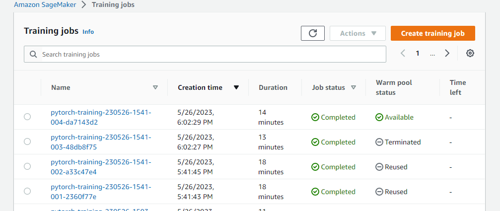
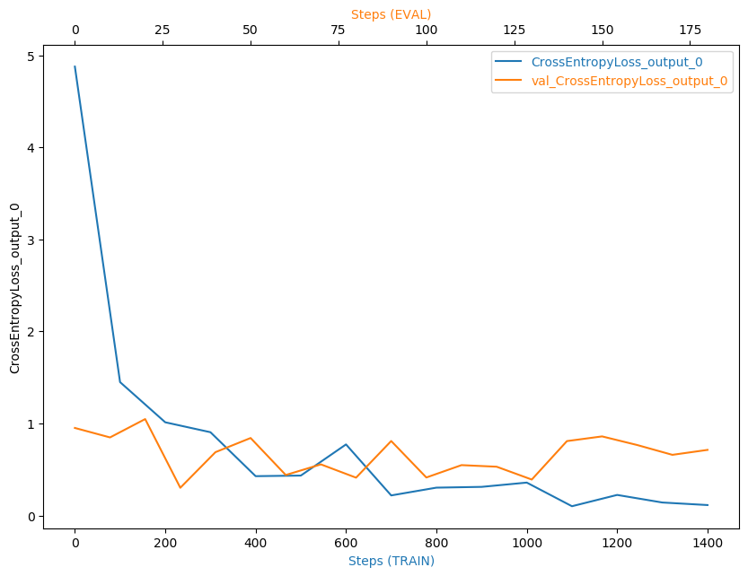
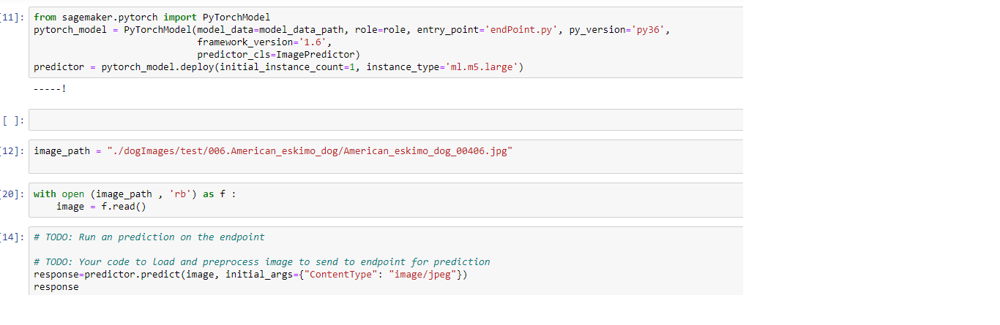
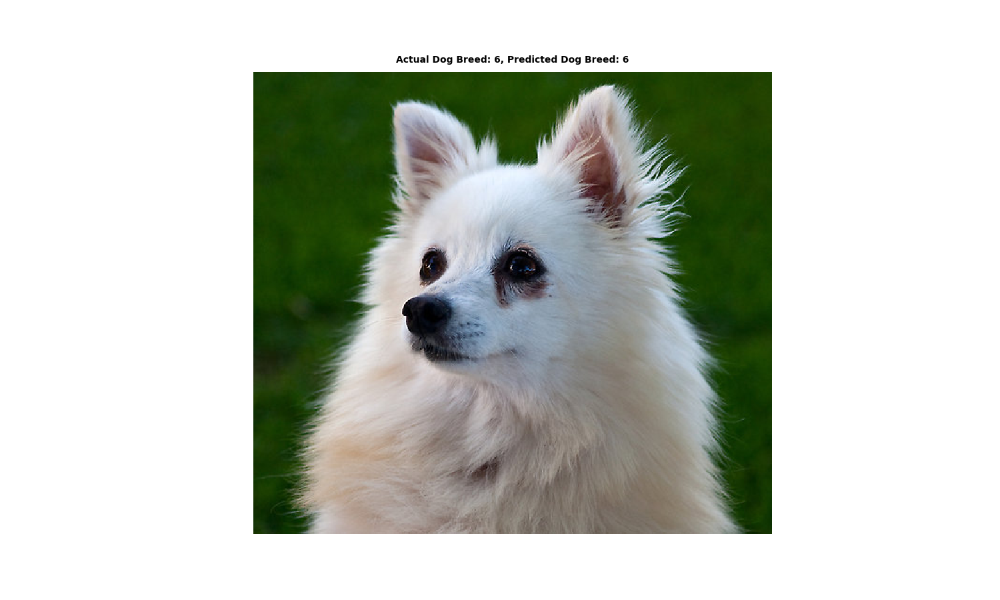
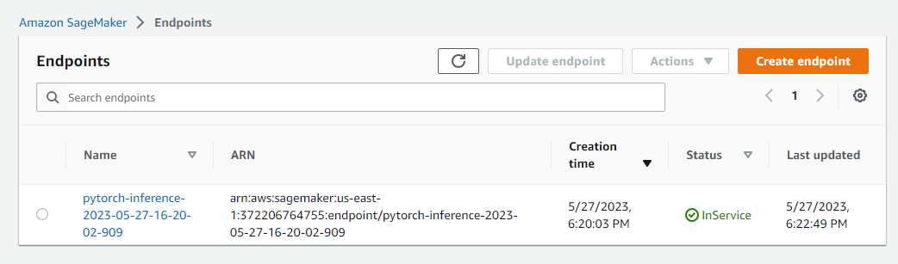

# Image Classification using AWS SageMaker

Use AWS Sagemaker to train a pretrained model that can perform image classification by using the Sagemaker profiling, debugger, hyperparameter tuning and other good ML engineering practices. This can be done on either the provided dog breed classication data set or one of your choice.

## Project Set Up and Installation
Enter AWS through the gateway in the course and open SageMaker Studio. 
Download the starter files.
Download/Make the dataset available. 

## Dataset
The provided dataset is the dogbreed classification dataset which can be found [Here](https://s3-us-west-1.amazonaws.com/udacity-aind/dog-project/dogImages.zip).

### Access
Upload the data to an S3 bucket through the AWS Gateway so that SageMaker has access to the data. 

## Hyperparameter Tuning
What kind of model did you choose for this experiment and why? Give an overview of the types of parameters and their ranges used for the hyperparameter search

* I have used The pretrained model ResNet50 to classify dog images with 133 dog breed/classes, 
* One fully connected layer has been used on top of ResNet50 model to predict 133 classes of dog breed.
* I have tuned a three ranges of hyperparameter: 
  * Batch-size: [32,64,128,256,512]
  * Epochs: (6,8)
  * Learning Rate: (0.001,0.1)
  And the best hyperparameters were:
  {"epochs": 7, "batch-size": 32, "lr": 0.0011643623459973611}

* Completed Training Jobs:

## Debugging and Profiling
**TODO**: Give an overview of how you performed model debugging and profiling in Sagemaker

Model debugging in sagemaker is done using the smdebug library which is a part of the sagemaker python sdk.

The Cross Entropy Loss Graph:

And Profiler Report could be found [Here](profiler-report.html)
### Results
**TODO**: What are the results/insights did you get by profiling/debugging your model?

The profiler report revealed that The batch size is too small, and GPUs are underutilized. Hence, the Recommendations were to either increase running on a smaller instance type or increasing the batch size.

## Model Deployment
**TODO**: Give an overview of the deployed model and instructions on how to query the endpoint with a sample input.

The model deployment has been implemented using [endPoint.py](endPoint.py) script.

In the notebook, I used the script as shown below:

* Inference Output:

**TODO** Remember to provide a screenshot of the deployed active endpoint in Sagemaker.

* Deployed Endpoint:

